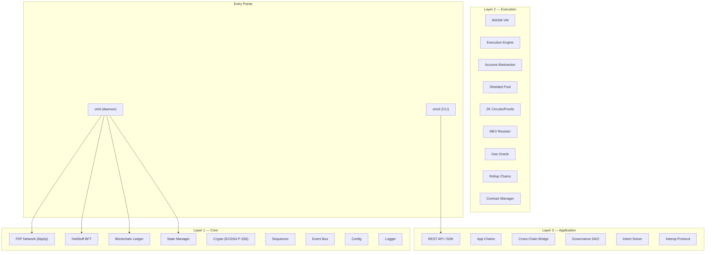

# Viri Blockchain — Project Summary & Flaw Analysis

## 1. What Is Viri?

**Viri** is an ambitious, Go-based Layer-1 blockchain with a 3-layer modular architecture. It aims to be a "production-ready" chain offering PoS+HotStuff BFT consensus, WASM/EVM smart contracts, ZK privacy, MEV resistance, cross-chain interop, and more.

| Attribute | Value |
|---|---|
| Language | Go 1.25 |
| Module | `github.com/viri-chain/viri` |
| Binaries | `virid` (daemon), `virictl` (CLI) |
| Networking | libp2p (GossipSub, Kademlia DHT, mDNS) |
| Storage | BadgerDB (with in-memory fallback) |
| Consensus | Custom HotStuff BFT + PoS staking |
| VM | Custom WASM interpreter |
| Docker | 4-validator local devnet via `docker-compose` |
| Roadmap | 15 phases — **only Phase 1 is checked off** |

---

## 2. Architecture Overview



### Source Stats (~100 Go files)

| Layer | Packages | Key Files |
|---|---|---|
| **L1 Core** | crypto, p2p, consensus, ledger, state, sequencer, events, config, logging | ~30 `.go` files |
| **L2 Execution** | vm, execution, accounts, agents, contracts, gas, mev, privacy, rollups, zk | ~20 `.go` files |
| **L3 Application** | api, appchain, bridge, governance, intent, interop, sdk | ~15 `.go` files |
| **Commands** | cmd/virid, cmd/virictl | 7 `.go` files |
| **Tests** | tests/integration, tests/benchmarks, tests/fuzz + per-package `_test.go` | ~40 files |

---

## 3. What Works

The project has genuine, non-trivial implementations in several areas:

- ✅ **P2P networking** — Full libp2p integration with GossipSub, Kademlia DHT, mDNS, peer scoring, rate limiting, connection management, and peer reputation tracking (~1,400 lines in [network.go](file:///d:/blockchain/internal/layer1/p2p/network.go))
- ✅ **HotStuff BFT consensus** — 3-phase (Prepare → PreCommit → Commit) with view changes, timeout certificates, double-sign detection, liveness tracking, slashing, and epoch rotation (~900 lines in [hotstuff.go](file:///d:/blockchain/internal/layer1/consensus/hotstuff.go))
- ✅ **Persistent storage** — BadgerDB-backed blockchain with batch writes, hash indexing, and in-memory fallback
- ✅ **JSON-RPC server** — Partial Ethereum-compatible RPC (`eth_blockNumber`, `eth_getBlockByNumber`, etc.)
- ✅ **Docker devnet** — 4-validator + explorer + bootstrap node via compose
- ✅ **Cross-platform builds** — Makefile targets for Linux, macOS, Windows, Raspberry Pi
- ✅ **Test scaffolding** — Unit, integration, benchmark, and fuzz test directories

---

## 4. Critical Flaws

### 🔴 SECURITY

#### 4.1 Fake Keccak256
> [!CAUTION]
> [keys.go:95-98](file:///d:/blockchain/internal/layer1/crypto/keys.go#L95-L98) — `Keccak256()` is **just SHA-256 under the hood**. This is fundamentally wrong—any component relying on Keccak (e.g., Ethereum-compatible addressing, EVM compatibility) will produce incorrect results.

```go
func Keccak256(data []byte) []byte {
    hash := sha256.Sum256(data) // ← This is NOT Keccak
    return hash[:]
}
```

#### 4.2 Unencrypted Private Key Storage
> [!CAUTION]
> [main.go:106](file:///d:/blockchain/cmd/virid/main.go#L106) — Validator private keys are written to disk as **raw hex**, no encryption, no passphrase, no keystore format. A file read by any local process leaks the key.

```go
os.WriteFile(keyFile, []byte(key.Hex()), 0600) // raw hex, no encryption
```

#### 4.3 Private Key Printed to Console
> [!WARNING]
> [virictl/main.go:189](file:///d:/blockchain/cmd/virictl/main.go#L189) — `wallet create` prints the full private key to stdout. Any terminal logger, screen share, or scrollback buffer captures it.

#### 4.4 Wildcard CORS in API Server
> [!WARNING]
> [api_server.go:70](file:///d:/blockchain/cmd/virid/api_server.go#L70) — `Access-Control-Allow-Origin: *` on a node that controls funds and consensus. Any website can make requests to a running node.

#### 4.5 No TLS on RPC/API
Both the JSON-RPC (port 8545) and REST API (port 8546) servers use plain HTTP. Credentials and transactions are transmitted in cleartext.

#### 4.6 Signature Bytes Deserialization Is Ambiguous
> [!WARNING]
> [keys.go:75-82](file:///d:/blockchain/internal/layer1/crypto/keys.go#L75-L82) — `Signature.Bytes()` concatenates R and S without length prefixes. Since R and S can be variable-length, there is **no way to unambiguously deserialize** the signature back.

---

### 🔴 CORRECTNESS

#### 4.7 Stub RPC Endpoints That Return Lies
Several "implemented" RPC methods return **hardcoded garbage** instead of real data:

| Method | File | Issue |
|---|---|---|
| `eth_getTransactionCount` | [rpc_server.go:227](file:///d:/blockchain/cmd/virid/rpc_server.go#L227) | Always returns `0x0` |
| `eth_getBalance` | [rpc_server.go:240](file:///d:/blockchain/cmd/virid/rpc_server.go#L240) | Always returns `0x0` |
| `eth_sendRawTransaction` | [rpc_server.go:253](file:///d:/blockchain/cmd/virid/rpc_server.go#L253) | Returns `"0xpending"` without doing anything |
| `eth_chainId` | [rpc_server.go:257](file:///d:/blockchain/cmd/virid/rpc_server.go#L257) | Hardcoded `"0x1"` (Ethereum mainnet!) regardless of config |
| `viri_nodeInfo` | [rpc_server.go:272](file:///d:/blockchain/cmd/virid/rpc_server.go#L272) | `"validator": true` hardcoded, even for non-validators |

#### 4.8 Transaction Send Is a No-Op
> [!IMPORTANT]
> [virictl/main.go:338-341](file:///d:/blockchain/cmd/virictl/main.go#L338-L341) — `tx send` parses the destination and amount, then discards both and prints a placeholder message. Funds literally cannot be sent.

```go
_ = toBytes
_ = amount
fmt.Println("Transaction sent (placeholder - requires key management)")
```

#### 4.9 State Root Is Not a Merkle Root
> [!WARNING]
> [state.go:145](file:///d:/blockchain/internal/layer1/state/state.go#L145) — The "state root" is `SHA256("state-<blockHeight>")` — a deterministic string hash with **no relation to actual state**. This defeats stateless verification, light clients, and state proofs entirely.

```go
sm.stateRoot = crypto.SHA256([]byte(fmt.Sprintf("state-%d", blockHeight)))
```

#### 4.10 Broken CLI API URL Construction
> [!WARNING]
> [virictl/main.go:132](file:///d:/blockchain/cmd/virictl/main.go#L132) — The `apiGet` function derives the API URL by slicing the last 4 characters off the RPC URL and appending `"8546"`. For any non-standard URL (different port length, path, etc.), this produces garbage.

```go
apiURL := rpcURL[:len(rpcURL)-4] + "8546" // ← brittle string surgery
```

#### 4.11 `createVoteData` Is Not Deterministic
> [!WARNING]
> [hotstuff.go:883-889](file:///d:/blockchain/internal/layer1/consensus/hotstuff.go#L883-L889) — Vote data is constructed by `fmt.Sprintf`-ing height/view into a fixed-size buffer with `copy`, which truncates and overlaps fields. Different validators will produce different vote data for the same inputs depending on integer string length.

#### 4.12 GetBlocks Silently Swallows Errors
[persistent_chain.go:156-158](file:///d:/blockchain/internal/layer1/ledger/persistent_chain.go#L156-L158) — If a block at a given height fails to deserialize, the error is silently `continue`d. The caller gets a partial result with no indication of missing blocks.

#### 4.13 Error Swallowed on Validator Account Creation
[main.go:200-202](file:///d:/blockchain/cmd/virid/main.go#L200-L202):
```go
_, err = stateMgr.CreateAccount(...)
if err != nil {
    _ = err  // ← literally discarded
}
```

---

### 🟡 ARCHITECTURE & DESIGN

#### 4.14 Layers Are Not Integrated
The 3-layer architecture is the project's main selling point, but **Layers 2 and 3 are completely disconnected** from the running daemon. The `virid` main.go only imports and uses Layer 1 packages. The WASM VM, execution engine, ZK proofs, privacy pool, governance DAO, bridge, intent solver, and rollups are **never instantiated or called**.

#### 4.15 Contract Execution Is Fake
[execution/engine.go:247-259](file:///d:/blockchain/internal/layer2/execution/engine.go#L247-L259) — `executeCall` does not actually run any contract code. It just checks if the contract has code and returns `{0x00}`.

#### 4.16 Contract Deployment Address Is Wrong
[execution/engine.go:224](file:///d:/blockchain/internal/layer2/execution/engine.go#L224) — Contract address is set to `tx.SenderAddress()`, meaning every contract deployed by the same sender overwrites the previous one.

#### 4.17 WASM VM Is a Toy
The [wasm.go](file:///d:/blockchain/internal/layer2/vm/wasm.go) VM is a custom opcode interpreter that:
- Skips WASM section parsing (jumps to byte 8 and starts executing)
- Has no function table, no module linking, no type checking
- `br`/`br_if` clear the stack and return — they don't handle label depths
- `call` uses string lookup (`"func_0"`, `"func_1"`) instead of a function index table
- Cannot run any real WASM binary compiled by standard toolchains

#### 4.18 ZK Proofs Are Not Cryptographic
The [zk/](file:///d:/blockchain/internal/layer2/zk) package implements constraint-system circuits and "proofs", but the prover just:
1. Evaluates the constraints in plain
2. Hashes the assignment as a "commitment"
3. There is **no zero-knowledge property** — no polynomial commitments, no Fiat-Shamir, no pairing-based math

#### 4.19 Privacy Pool Is In-Memory Only
[shielded_pool.go](file:///d:/blockchain/internal/layer2/privacy/shielded_pool.go) stores all notes, nullifiers, and commitments in **memory maps**. Everything is lost on restart. The "shielded" pool also stores `Value` and `Owner` in plaintext in the `Note` struct.

#### 4.20 MEV "Resistance" Is Just Tx Sorting
The [MEVResistor](file:///d:/blockchain/internal/layer2/mev/resistor.go) sorts transactions by gas price or by `gasPrice * amount`. There is no commit-reveal scheme, no threshold encryption, no TEE integration, no fair ordering protocol — just a configurable `sort.Slice`.

#### 4.21 Nonce Check Is Off-By-One
[execution/engine.go:118](file:///d:/blockchain/internal/layer2/execution/engine.go#L118) — `if tx.Nonce <= sender.Nonce` rejects nonces equal to the current nonce, but standard blockchain semantics require `tx.Nonce == sender.Nonce` for the next valid transaction. This would reject the first transaction from any new account.

#### 4.22 No Graceful Shutdown for Servers
The RPC server has a `Stop()` method but it's never called during shutdown. The API server's `Stop()` uses `Close()` (hard kill) instead of `Shutdown()` (graceful drain).

#### 4.23 Block Index Grows Unbounded in Memory
[persistent_chain.go:21](file:///d:/blockchain/internal/layer1/ledger/persistent_chain.go#L21) — `blockIndex map[string]uint64` loads the hash of **every block ever** into memory on startup. This becomes a significant memory leak as the chain grows.

#### 4.24 Duplicate `uint64ToBytes` Definitions
The function `uint64ToBytes` is defined identically in at least 3 packages: `ledger`, `privacy`, and `state`. There is no shared utility package.

---

### 🟡 INFRASTRUCTURE & OPS

#### 4.25 Docker Compose Requires Manual Peer ID
The compose file references `${BOOTSTRAP_PEER_ID}` which must be manually extracted from the bootstrap node's logs and set as an environment variable. There's no automation for this.

#### 4.26 Dockerfile User/Group Name Mismatch
[Dockerfile:16-17](file:///d:/blockchain/docker/Dockerfile#L16-L17) — Creates user/group `nexus` but the project is called `viri`. This looks like a copy-paste artifact from another project.

#### 4.27 No CI/CD Pipeline
The `.github/workflows/` directory exists but was not examined for content. The roadmap lists "CI" as Phase 15 (the last phase), meaning automated testing is deferred to the very end.

#### 4.28 Committed Binaries in Repo
`virid.exe` (46MB) and `virictl.exe` (8.7MB) are committed to the repository root, plus duplicates in `build/`. This bloats the git history permanently.

#### 4.29 `go.mod` Version Inconsistency
The README says "Go 1.22+" but `go.mod` specifies `go 1.25.7` — a version that doesn't exist yet (current latest is 1.22.x as of 2024). The dependencies reference future dates (2026), suggesting fabricated or auto-generated module versions.

---

## 5. Severity Summary

| Severity | Count | Examples |
|---|---|---|
| 🔴 **Critical** | 6 | Fake Keccak, unencrypted keys, stub RPCs returning lies, fake state root |
| 🟠 **Major** | 8 | Disconnected L2/L3, toy WASM VM, non-cryptographic ZK, no-op tx send |
| 🟡 **Moderate** | 9 | Wildcard CORS, memory-only privacy, broken CLI URL, off-by-one nonce |
| 🔵 **Minor** | 6 | Duplicate utilities, committed binaries, Dockerfile naming, no CI |

---

## 6. Bottom Line

Viri has a **well-organized code structure** and genuine effort in the P2P and consensus layers. However, the project is at a very early prototype stage despite claiming "production-ready" status:

1. **Only Layer 1 is wired up** — Layers 2 and 3 exist as isolated library code that is never called
2. **Core crypto primitives are wrong** — Keccak256 is fake, signature serialization is ambiguous
3. **The RPC layer actively lies** — Returning hardcoded zeros for balances and nonces makes the node appear functional while being completely non-operational
4. **Security fundamentals are missing** — No key encryption, no TLS, wildcard CORS, private keys printed to stdout
5. **Advanced features are facades** — ZK proofs aren't zero-knowledge, the WASM VM can't run real WASM, MEV resistance is just sorting

The project needs to **drop the "production-ready" claim**, honestly mark its actual completion level (~15-20% of roadmap), and prioritize fixing the crypto and security foundations before adding more features.
